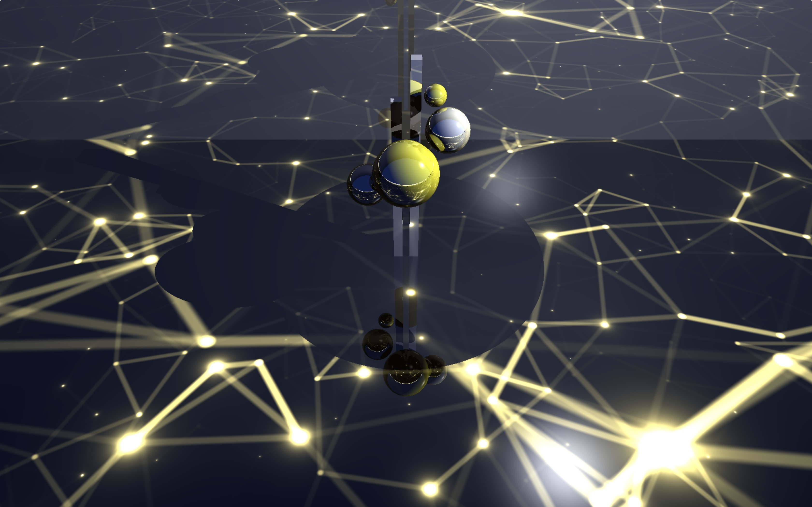
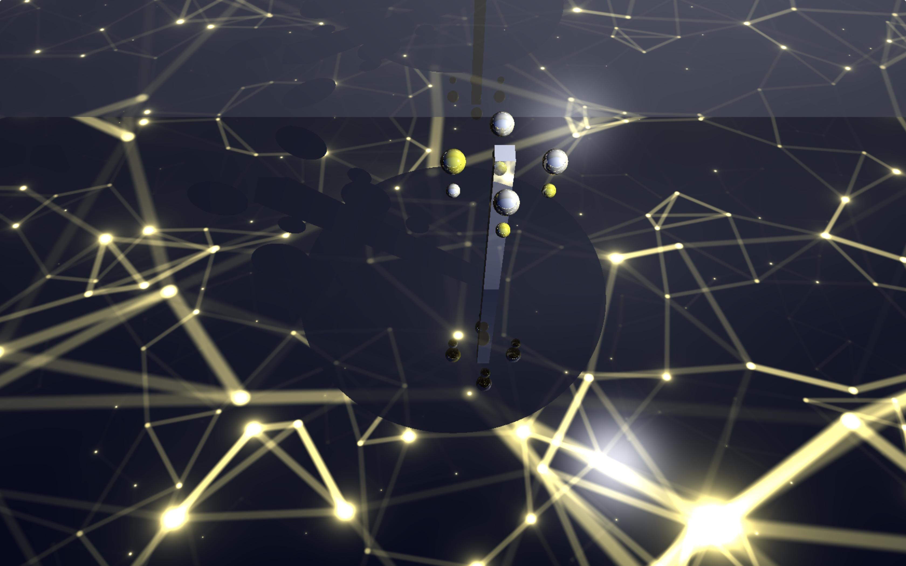
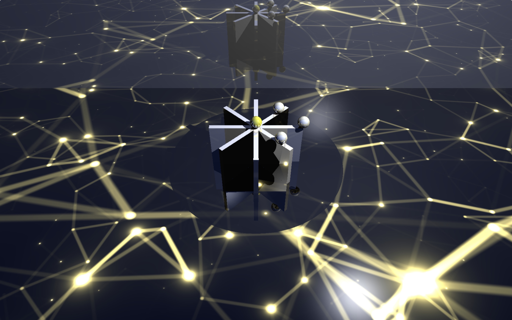

# Galaxy of Trigonometry

> A WebGL ray-tracing artifact, finished during 2019 NUS SWS.
>
> Galaxy is a mix of chaos and harmony: unpredictable things happen at each moment while a few graceful math rules are revealed. By combining trigonometry and straight-line motions in a well-designed way, this project offers a glimpse of the beauty of Galaxy.

## Media links of results

## Screen capture

### scene 1

### scene 2

### scene 3

## Other Interesting Shaders

### \* : Reference of this project

| index | name   | url                                   |
| ----- | ------ | ------------------------------------- |
| 0     | Planet | https://www.shadertoy.com/view/4tjGRh |
| 1     | Shiny ball | https://www.shadertoy.com/view/llB3zG |
| 2     | Acrobatics | https://www.shadertoy.com/view/llXSWr |
| 3     | Mobile illuminant | https://www.shadertoy.com/view/MlX3RH |
| 4     | Movie picture(not useful) | https://www.shadertoy.com/view/Msc3WH |
| 5     | Fantastic background | https://www.shadertoy.com/view/XtjGR3 |
| 6     | Interesting ball | https://www.shadertoy.com/view/XsB3W3 |
| 7     | Crazy Universe | https://www.shadertoy.com/view/XlccRB |
| 8* | Universe within | https://www.shadertoy.com/view/lscczl |

## Script

| index | Offset | duration(s) | description              |
| ----- | ------ | ----------- | ------------------------ |
| 0     | 0      | 4 * (2 + 2) | 小球随轨道升起2s，停留2s |
| 1     | 16     | 2           | 轨道下降、镜头上拉2s     |
| 2     | 18     | 2           | 停留2s                   |
| 3     | 20     | 2           | 旗杆、另四个小球升起     |
| 4     | 22     | 4 * 2       | 旋转两周                 |
| 5     | 30     | 2           | 旗杆、小球下降           |
| 6     | 32     | 8           | 树升起                   |
| 7     | 40     | 16          | 转动镜头                 |
| 8     | 56     | 8           | 树落下                   |

